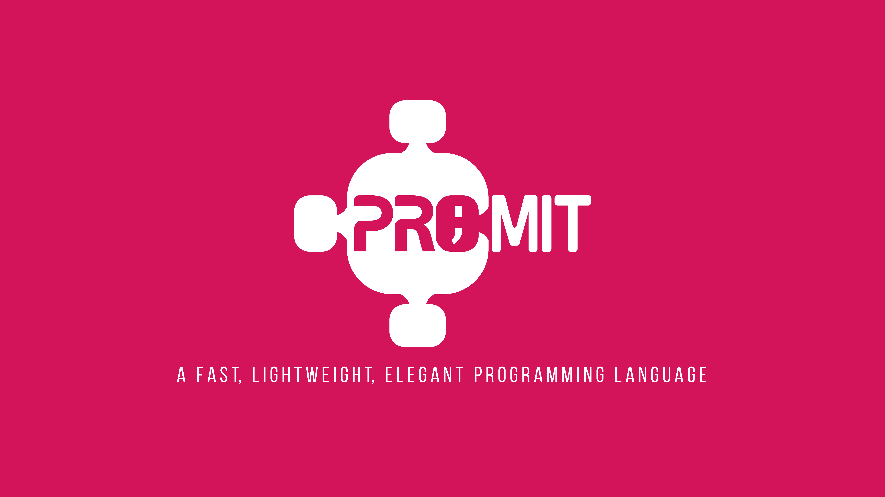

<h1 align= "center">Project Promit</h1>
<p align= "center">A programming language inspired by JavaScript and Python!</p>
<div align= "center">
	<a href= "#introduction">Introduction</a>
	.
	<a href= "#why">Why</a>
	.
	<a href= "#build">Build</a>
</div>

## Introduction
Promit is <b>object oriented</b>, <b>bytecode interpreted</b>, <b>lightweight</b>, <b>elegant</b> and <b>fast</b> programming language. It has simple yet <b>aesthetic syntax</b> and easy, <b>condensed</b> library  which helps to tackle down any modern programs.

**Key features :** 
- High-Level Language with dynamically typed syntax.
```dart
// Take the name as an input string.
take name = recieve(string);

// Now print the name.
showl 'Your name is : $name!';
```
- Fast, stack-based bytecode interpreter with rich single-pass compiler.
- Fully Object Oriented with class and instances.
```dart
const cities = [ 'New York', 'Constantinople', 'Sin City (Vegas)' ];

const class Promit {
	const visit(city) {
		showl 'Promit has visited $city!';
	}
};

take promit = Promit();

cities.foreach(fn(city) {
	promit.visit(city);
});

showl "The variable 'promit' is ${typeof promit} and ${promit instof Promit}.";
```
- Supports inheritance.
```dart
class Breakfast {
	have() {
		showl "Dalicious!";
	}
};

class Soup is Breakfast {
	have() {
		showl "Isn't having soup for breakfast too odd!";
		
		super.have();
	}
};

take breakfast = Soup();

breakfast.have();
```
- Automated memory management with a swift Mark-Sweep garbage collector.
```dart
take string = "This is a string! Rest easy!";

// GC.
```
- Modern string interpolation.
```dart
show "Enter two numbers : ";

take a = recieve(num), b = recieve(num);

showl 'Summation of those two numbers is : ${a + b}!';
```
- Minimalist library.
```dart
take dictionary = {
	'name'(const) :  'SD Asif Hossein',
	'age'(const)  :  19,    // Now, yes.
	'passion'     :  'Programming'
};

showl 'key-value pair is : ';

dictionary.keys()    // Returns a list.
	.foreach( fn(key) {
		showl "$key : ${dictionary[key]}"
} );
```
- Has functions and closures (Yeah, I know you've already guessed).
```dart
const fn call() {
	take outer = "This is outer!";

	// Closure capturing 'outer' variable.
	return fn() {
		showl outer;
		showl 'Changing outer variable!';
		
		outer = "Now it's inner!";
	
		return outer;
	}
}

take result = call();    // result is actually the returned closure.

showl typeof result;    // Expected 'closure'.

showl result();         // Expected "Now it's inner!";
```
 - Has ```continue ``` in switch.
```dart
take bird = 'Duck';

switch(bird) {
	case 'Koel' : {
		showl 'The bird is Koel!';
		break;
	}
	case 'Duck' : {
		showl 'The bird is Duck (maybe)!';
		continue;    // Code will fallthrough to next case.
		showl 'This portion will not be executed!!';
		break;
	}
	case 'Fallthrough' : showl 'Fallthrough!'; break;
	default : break;
}
```
 - Has loops (``while``, ``for``, ```do ... while```), control flow (``if``, ``else`` and ternary operator ```condition ? expr : else_expr```) and many more!

## Why


<p align= "justify">Well the idea is very simple. I started my programming journey as a Web Developer. As I got deeper inside the computer science stuff and programming languages, I reinvented my interests in Low-Level things such as kernel development, memory managements, operating systems, compiler design, etc. At the same time, I got into high school (At the time of writing, I'm 19 BTW). I met a very fascinating person, who is one of my dearest friends named <b>Meraj Hossain Promit</b>. He was a real inspiration. A lot of thing went through. Long story short, when I was a first year at high school, I promised him that I would make a full fledged programming language with the honor of his name under age of 20. You can see the rest.</p>

## Build
### Prerequisites :
 - ``gcc`` (checked with gcc-10, gcc-11 and gcc-12, any version greater than 6 will do)
 - ``make`` to run the ``Makefile``.
 - ``git`` to clone the repo (Optional).
 
### Installation :
**Arch Linux/Manjaro/Arch Based :**
```arch
pacman --sync git base-devel
```
**Debian/Ubuntu/Debian Based :**
```debian
apt install git build-essential
```
**Windows :**

Switch to linux 😁. Nah, just kidding.

Install ``MinGW-w64``, ``Cygwin`` or ``TDM GCC`` which has ``make`` baked within it.

Install git from : <a href= "https://git-scm.com/downloads">https://git-scm.com/downloads</a>.

### The hard stuff :
Go to any folder, clone the repo and hit ``make``.
```
git clone https://github.com/singul4ri7y/promit
cd promit/promit
make build_release_x64
cd ../bin/Release-x64/
```
Enjoy the binary.

**Configurations :**
- ``make`` or ``make build_debug_x64`` builds the project in Debug configuration and x64 architecture.
- ``make build_debug_x86`` builds the project in Debug configuration and x86 architecture.
- ``make build_release_x64`` builds the project in Release configuration and x64 architecture.
- ``make build_release_x86`` builds the project in Release configuration and x86 architecture.

<i>Peace.</i>
